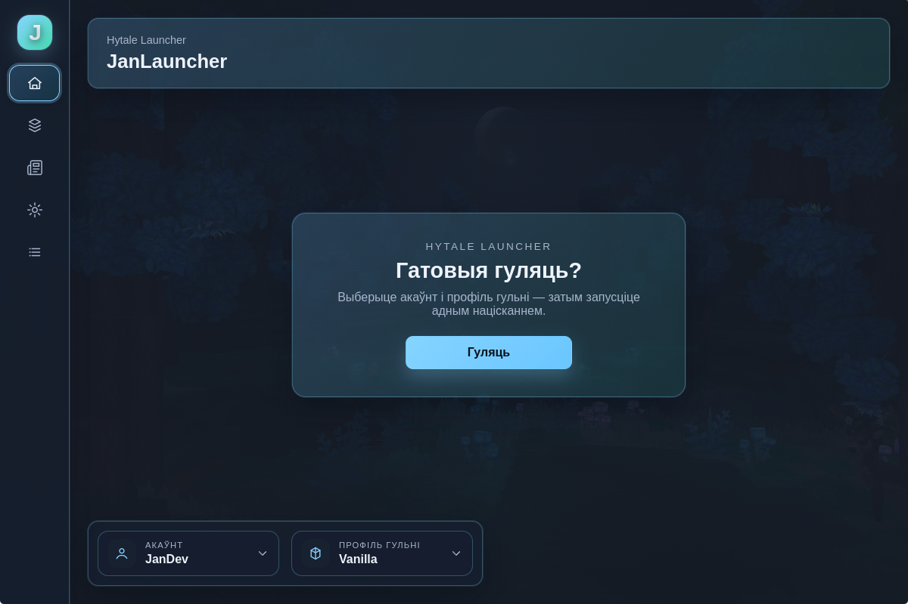
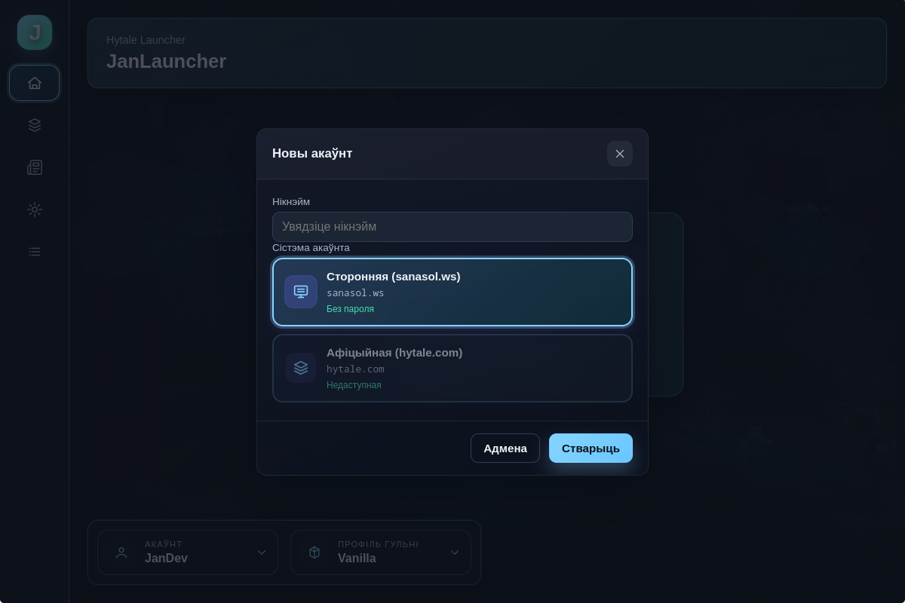
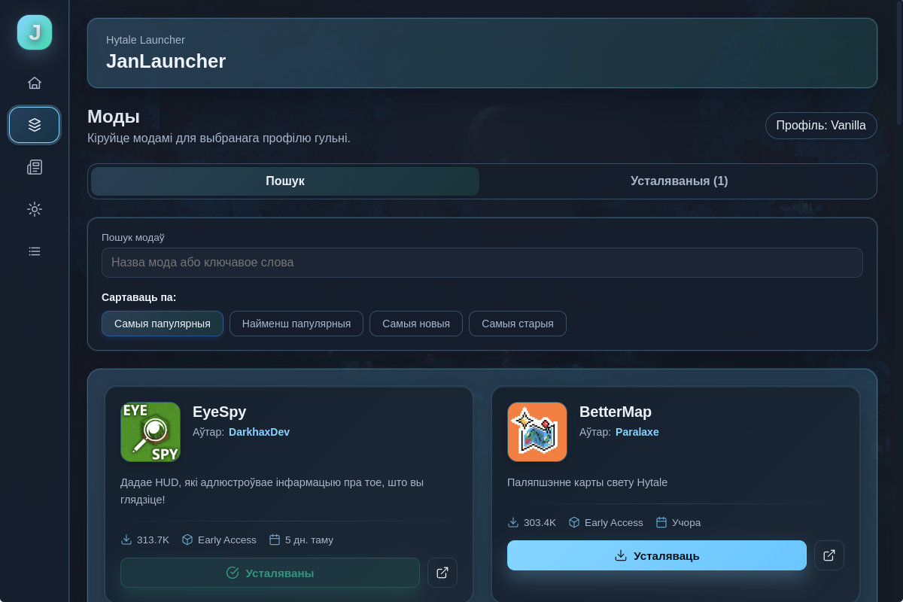
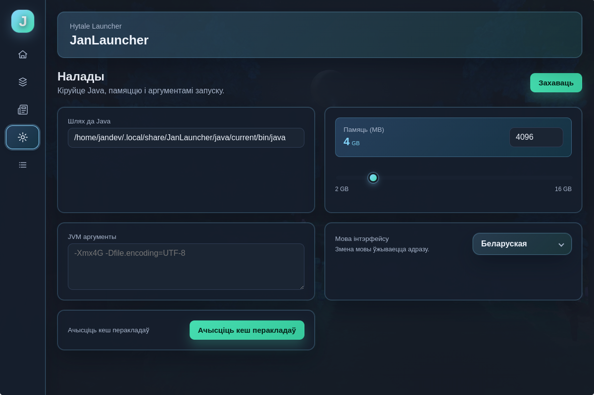
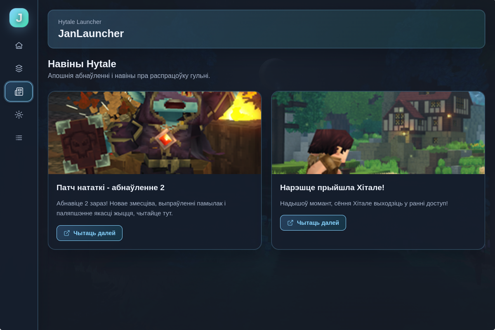

# 🎮 JanLauncher

**Сучасны і зручны лаунчэр для Hytale**

---

<!--  -->

---

## 📖 Што такое JanLauncher?

JanLauncher — гэта сучасны кроссплатформенны лаунчэр, створаны спецыяльна для Hytale. Ён забяспечвае плаўны і інтуітыўны вопыт кіравання гульнёй, профілямі, модамі і многім іншым — усё ў адным месцы.

Незалежна ад таго, ці вы звычайны гульцоў, ці любіце наладжваць свой гульнявы вопыт, JanLauncher спрашчае хуткі і эфектыўны запуск Hytale.

---

## ✨ Магчымасці

### 🚀 Хуткі запуск
Запускайце Hytale ўсяго некалькімі клікамі. Ніякіх складаных налад — усё працуе з скрынкі.

### 👤 Профілі гульцоў
Стварайце і кіруйце некалькімі профілямі гульцоў. Лёгка пераключайцеся паміж рознымі акаунтамі і трымайце свой прагрэс арганізаваным.

### 🧩 Профілі гульні і моды
Арганізуйце налады гульні і моды з дапамогай карыстальніцкіх профіляў. Кожны профіль можа мець сваю канфігурацыю модаў, што спрашчае пераключэнне паміж рознымі гульнявымі сцэнарыямі.

### 📦 Устаноўка і абнаўленні
Аўтаматычная ўстаноўка і абнаўленне гульні. JanLauncher бярэ на сябе ўсе тэхнічныя дэталі, каб вы маглі засяродзіцца на гульні.

### ☕ Аўтаматычнае кіраванне Java
Не трэба турбавацца пра версіі Java. JanLauncher аўтаматычна вызначае, загружае і кіруе правільнай версіяй Java для Hytale.

### 🔄 Аўтаматычныя абнаўленні
Лаунчэр абнаўляецца аўтаматычна, таму ў вас заўсёды ёсць апошнія функцыі і паляпшэнні без лішніх клопатаў.

### 🌍 Навіны і пераклады
Будзьце ў курсе апошніх навін Hytale прама ў лаунчэры. Шматмоўная падтрымка гарантуе, што вы можаце атрымліваць задавальненне ад JanLauncher на сваёй мове.

### 🧪 Некалькі сістэм аўтарызацыі
Падтрымка розных метадаў аўтэнтыфікацыі, што дае вам гнуткасць у доступе да вашага акаунту.

---

## 📸 Скрыншоты

### Галоўны экран

*Галоўны інтэрфейс лаунчэра*

### Профілі гульцоў

*Кіраванне профілямі гульцоў*

### Менеджэр модаў

*Прагляд і ўстаноўка модаў з CurseForge*

### Налады

*Налада вашага вопыту выкарыстання лаунчэра*

### Стужка навін

*Будзьце ў курсе навін Hytale*

---

## 📥 Спампаванне і ўстаноўка

### Крок 1: Спампаванне
1. Перайдзіце на [GitHub Releases](https://github.com/janekdeveloper/JanLauncher/releases)
2. Знайдзіце апошнюю версію
3. Спампуйце ўсталёўшчык для вашай платформы:
   - **Windows**: `JanLauncher Setup X.X.X.exe`
   - **Linux**: `jan-launcher-X.X.X.AppImage` або пакет `.deb`

### Крок 2: Устаноўка
- **Windows**: Запусціце ўсталёўшчык `.exe` і выконвайце інструкцыі майстра ўстаноўкі
- **Linux**: 
  - Для AppImage: Зрабіце файл выканальным (`chmod +x jan-launcher-X.X.X.AppImage`) і запусціце яго
  - Для .deb: Усталюйце з дапамогай `sudo dpkg -i jan-launcher_X.X.X_amd64.deb`

### Крок 3: Запуск
Адкрыйце JanLauncher з меню праграм або ярлыка на працоўным стале. Лаунчэр правядзе вас праз пачатковую наладку.

---

## 🎯 Пачатак працы

1. **Першы запуск**: Пры першым адкрыцці JanLauncher дапаможа вам наладзіць першы профіль гульца і базавыя налады.

2. **Устаноўка Hytale**: Калі вы яшчэ не ўсталявалі Hytale, лаунчэр прапануе аўтаматычна спампаваць і ўсталяваць яго для вас.

3. **Стварэнне профіляў**: Наладзьце профілі гульцоў і гульнявыя профілі для арганізацыі вашага гульнявога вопыту.

4. **Устаноўка модаў** (апцыянальна): Пераглядзіце бібліятэку модаў і ўсталюйце моды для паляпшэння вашага вопыту ў Hytale.

5. **Гуляйце**: Націсніце кнопку запуску і атрымлівайце задавальненне ад Hytale!

---

## 💬 Супольнасць і падтрымка

### Discord сервер
Далучайцеся да нашай супольнасці Discord, каб атрымаць дапамогу, падзяліцца водгукамі і паспалукацца з іншымі гульцамі:

### Telegram канал
Падпісвайцеся на наш Telegram канал для абнаўленняў, навін і анансаў:

### Праблемы і водгукі
Знайшлі памылку або ёсць прапановы? Калі ласка, стварыце issue на GitHub:
[GitHub Issues](https://github.com/janekdeveloper/JanLauncher/issues)

### Унёсак у праект
Мы вітаем унёсак! Калі вы хочаце дапамагчы палепшыць JanLauncher, калі ласка, азнаёмцеся з нашымі рэкамендацыямі па ўдзеле (хутка).

---

## 📝 Ліцэнзія

Гэты праект ліцэнзаваны пад ліцэнзіяй MIT — гл. файл [LICENSE](LICENSE) для дэталяў.

---

## 🙏 Падзякі

- Створана з каханнем для супольнасці Hytale
- Дзякуем усім удзельнікам і тэсціроўшчыкам
- Асаблівая падзяка ўсім, хто прадастаўляе водгукі і прапановы

---

**Зроблена з ❤️ для супольнасці Hytale**

⭐ Калі JanLauncher вам карысны, калі ласка, пастаўце зорку! ⭐

