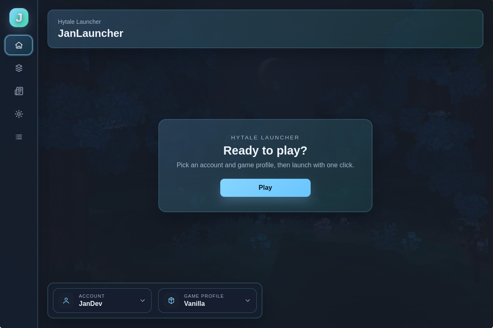
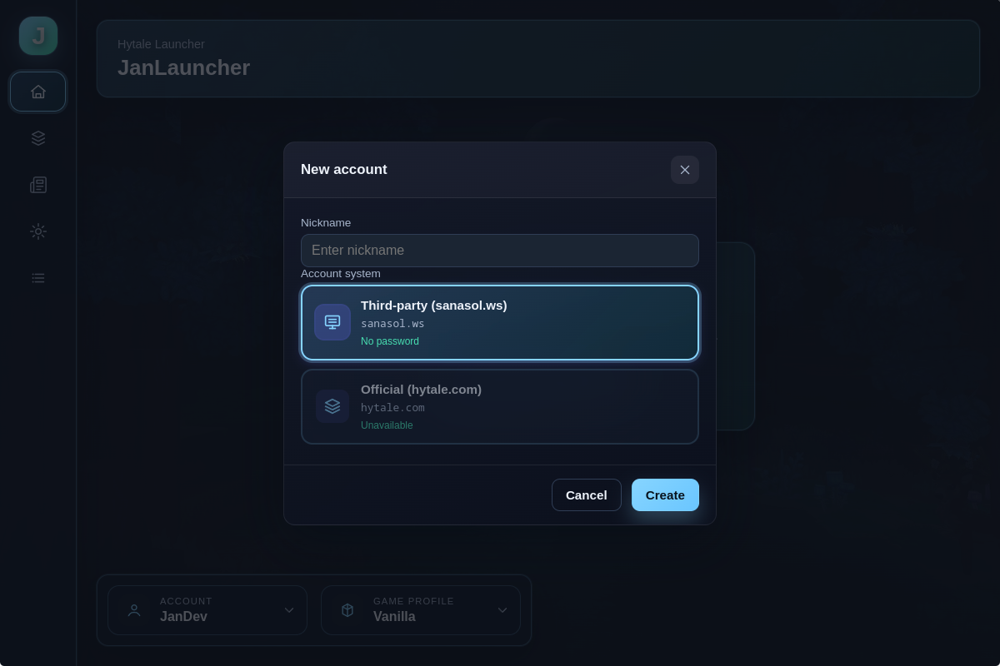
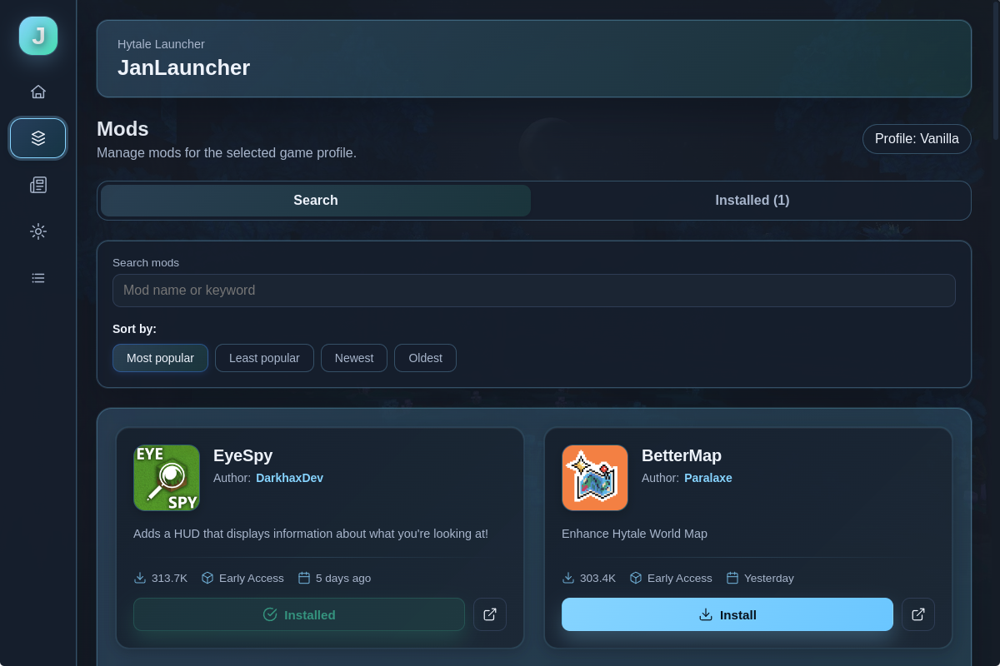
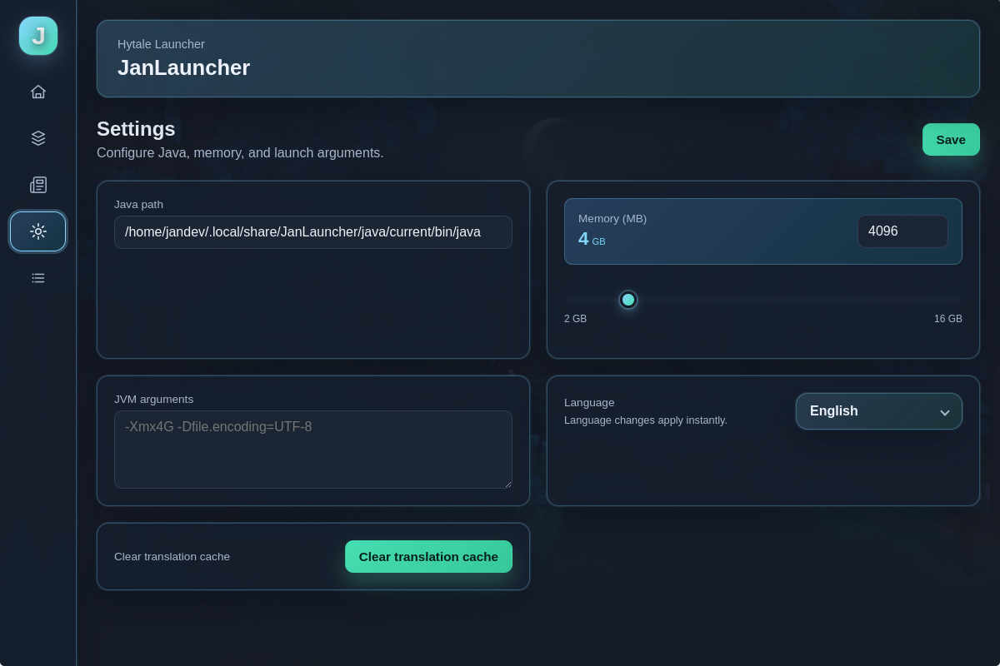
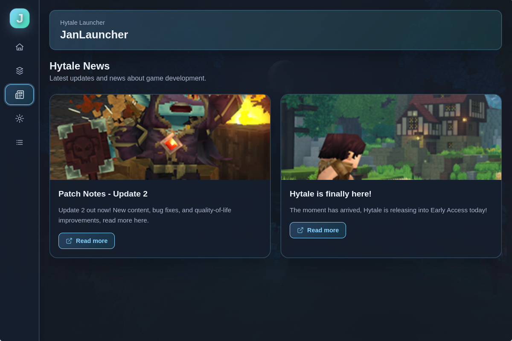

# 🎮 JanLauncher

**A modern, user-friendly launcher for Hytale**

---

---

## 📖 What is JanLauncher?

JanLauncher is a modern, cross-platform launcher designed specifically for Hytale. It provides a smooth and intuitive experience for managing your game, profiles, mods, and more—all in one place.

Whether you're a casual player or someone who loves customizing their game experience, JanLauncher makes it easy to get into Hytale quickly and efficiently.

---

## ✨ Features

### 🚀 Quick Launch
Launch Hytale with just a few clicks. No complicated setup required—everything works out of the box.

### 👤 Player Profiles
Create and manage multiple player profiles. Switch between different accounts effortlessly and keep your progress organized.

### 🧩 Game Profiles & Mods
Organize your game settings and mods with custom profiles. Each profile can have its own mod configuration, making it easy to switch between different gameplay experiences.

### 📦 Installation & Updates
Automatic game installation and updates. JanLauncher handles all the technical details, so you can focus on playing.

### ☕ Automatic Java Management
No need to worry about Java versions. JanLauncher automatically detects, downloads, and manages the correct Java runtime for Hytale.

### 🔄 Auto-Updates
The launcher updates itself automatically, so you always have the latest features and improvements without any hassle.

### 🌍 News & Translations
Stay up to date with the latest Hytale news directly in the launcher. Multi-language support ensures you can enjoy JanLauncher in your preferred language.

### 🧪 Multiple Authentication Systems
Support for different authentication methods, giving you flexibility in how you access your account.

---

## 📸 Screenshots

### Main Screen

*The main launcher interface*

### Player Profiles

*Manage your player profiles*

### Mods Manager

*Browse and install mods from CurseForge*

### Settings

*Customize your launcher experience*

### News Feed

*Stay updated with Hytale news*

---

## 📥 Download & Installation

### Step 1: Download
1. Go to [GitHub Releases](https://github.com/janekdeveloper/JanLauncher/releases)
2. Find the latest version
3. Download the installer for your platform:
   - **Windows**: `JanLauncher Setup X.X.X.exe`
   - **Linux**: `jan-launcher-X.X.X.AppImage` or `.deb` package

### Step 2: Install
- **Windows**: Run the `.exe` installer and follow the setup wizard
- **Linux**: 
  - For AppImage: Make it executable (`chmod +x jan-launcher-X.X.X.AppImage`) and run it
  - For .deb: Install with `sudo dpkg -i jan-launcher_X.X.X_amd64.deb`

### Step 3: Launch
Open JanLauncher from your applications menu or desktop shortcut. The launcher will guide you through the initial setup.

---

## 🎯 Getting Started

1. **First Launch**: When you first open JanLauncher, it will help you set up your first player profile and configure basic settings.

2. **Install Hytale**: If you haven't installed Hytale yet, the launcher will offer to download and install it for you automatically.

3. **Create Profiles**: Set up your player profiles and game profiles to organize your gameplay experience.

4. **Install Mods** (Optional): Browse the mod library and install mods to enhance your Hytale experience.

5. **Play**: Click the launch button and enjoy Hytale!

---

## 💬 Community & Support

### Discord Server
Join our Discord community to get help, share feedback, and connect with other players:

### Telegram Channel
Follow our Telegram channel for updates, news, and announcements:

### Issues & Feedback
Found a bug or have a suggestion? Please open an issue on GitHub:
[GitHub Issues](https://github.com/janekdeveloper/JanLauncher/issues)

### Contributing
We welcome contributions! If you'd like to help improve JanLauncher, please check out our contributing guidelines (coming soon).

---

## 📝 License

This project is licensed under the MIT License - see the [LICENSE](LICENSE) file for details.

---

## 🙏 Acknowledgments

- Built with love for the Hytale community
- Thanks to all contributors and testers
- Special thanks to everyone who provides feedback and suggestions

---

**Made with ❤️ for the Hytale community**

⭐ If you find JanLauncher useful, please give it a star! ⭐

