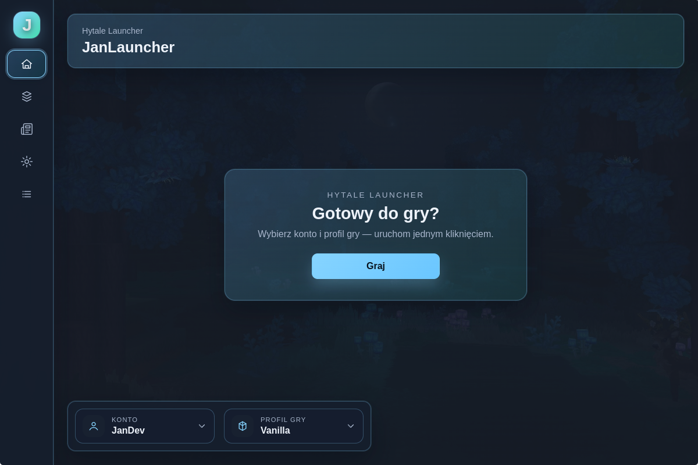
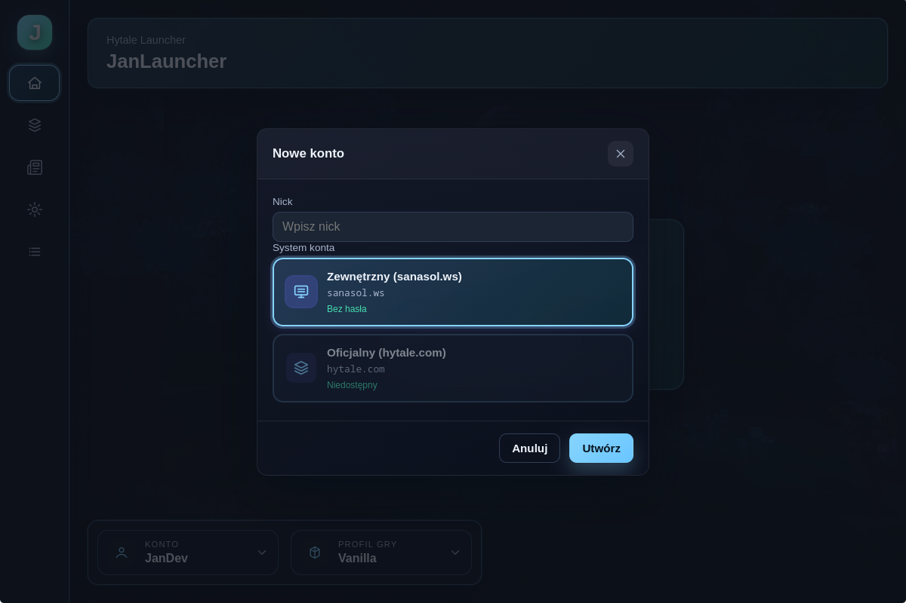
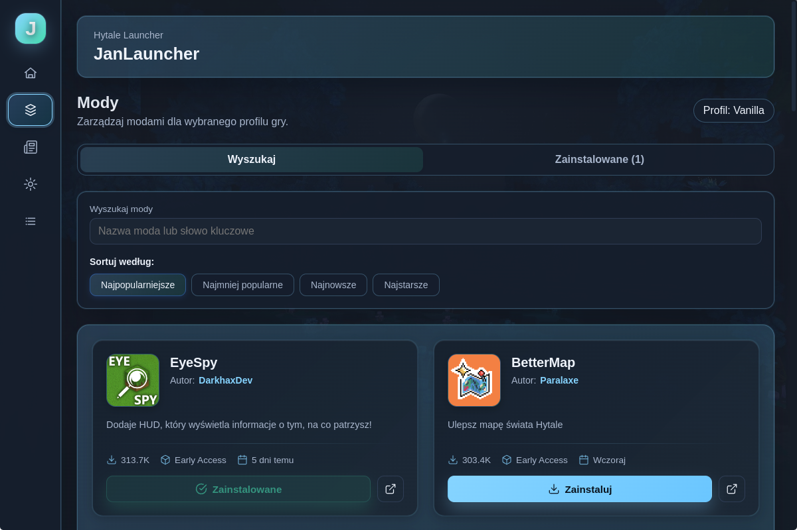
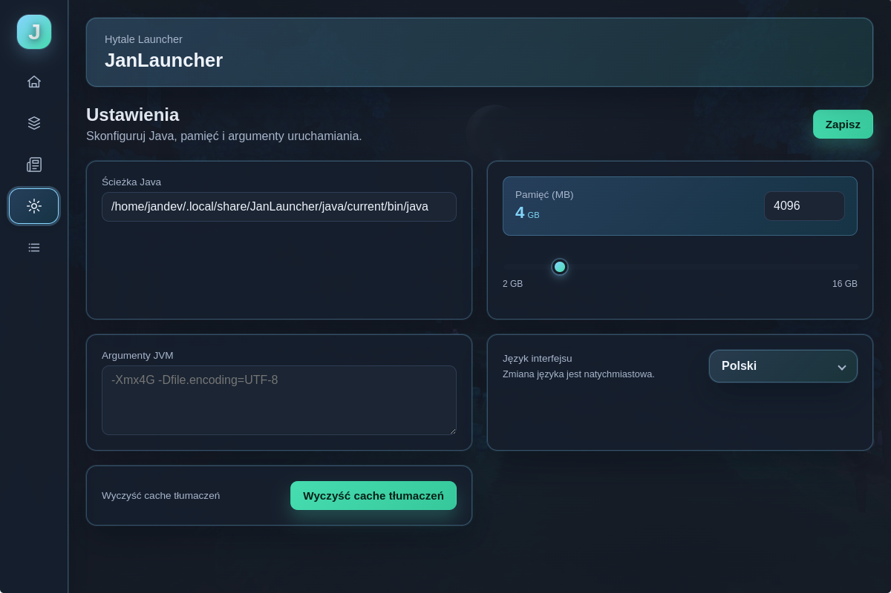

# 🎮 JanLauncher

**Nowoczesny i przyjazny launcher dla Hytale**

---

<!--  -->

---

## 📖 Czym jest JanLauncher?

JanLauncher to nowoczesny, wieloplatformowy launcher stworzony specjalnie dla Hytale. Zapewnia płynne i intuicyjne doświadczenie w zarządzaniu grą, profilami, modami i wieloma innymi rzeczami — wszystko w jednym miejscu.

Niezależnie od tego, czy jesteś zwykłym graczem, czy kochasz dostosowywać swoje doświadczenie z gry, JanLauncher ułatwia szybkie i efektywne uruchomienie Hytale.

---

## ✨ Funkcje

### 🚀 Szybkie uruchamianie
Uruchamiaj Hytale zaledwie kilkoma kliknięciami. Bez skomplikowanej konfiguracji — wszystko działa od razu.

### 👤 Profile graczy
Twórz i zarządzaj wieloma profilami graczy. Łatwo przełączaj się między różnymi kontami i utrzymuj swój postęp w porządku.

### 🧩 Profile gry i mody
Organizuj ustawienia gry i mody za pomocą niestandardowych profili. Każdy profil może mieć własną konfigurację modów, co ułatwia przełączanie między różnymi scenariuszami rozgrywki.

### 📦 Instalacja i aktualizacje
Automatyczna instalacja i aktualizacja gry. JanLauncher zajmuje się wszystkimi szczegółami technicznymi, abyś mógł skupić się na grze.

### ☕ Automatyczne zarządzanie Java
Nie musisz martwić się o wersje Java. JanLauncher automatycznie wykrywa, pobiera i zarządza odpowiednią wersją Java dla Hytale.

### 🔄 Automatyczne aktualizacje
Launcher aktualizuje się automatycznie, więc zawsze masz najnowsze funkcje i ulepszenia bez żadnych kłopotów.

### 🌍 Wiadomości i tłumaczenia
Bądź na bieżąco z najnowszymi wiadomościami Hytale bezpośrednio w launcherze. Wsparcie wielojęzyczne zapewnia, że możesz cieszyć się JanLauncher w swoim preferowanym języku.

### 🧪 Wiele systemów uwierzytelniania
Wsparcie dla różnych metod uwierzytelniania, dając Ci elastyczność w dostępie do swojego konta.

---

## 📸 Zrzuty ekranu

### Ekran główny

*Główny interfejs launcher'a*

### Profile graczy

*Zarządzanie profilami graczy*

### Menedżer modów

*Przeglądanie i instalowanie modów z CurseForge*

### Ustawienia

*Dostosuj swoje doświadczenie z launcher'a*

### Kanał wiadomości

*Bądź na bieżąco z wiadomościami Hytale*

---

## 📥 Pobieranie i instalacja

### Krok 1: Pobieranie
1. Przejdź do [GitHub Releases](https://github.com/janekdeveloper/JanLauncher/releases)
2. Znajdź najnowszą wersję
3. Pobierz instalator dla swojej platformy:
   - **Windows**: `JanLauncher Setup X.X.X.exe`
   - **Linux**: `jan-launcher-X.X.X.AppImage` lub pakiet `.deb`

### Krok 2: Instalacja
- **Windows**: Uruchom instalator `.exe` i postępuj zgodnie z instrukcjami kreatora instalacji
- **Linux**: 
  - Dla AppImage: Uczyń plik wykonywalnym (`chmod +x jan-launcher-X.X.X.AppImage`) i uruchom go
  - Dla .deb: Zainstaluj za pomocą `sudo dpkg -i jan-launcher_X.X.X_amd64.deb`

### Krok 3: Uruchomienie
Otwórz JanLauncher z menu aplikacji lub skrótu na pulpicie. Launcher przeprowadzi Cię przez początkową konfigurację.

---

## 🎯 Rozpoczęcie pracy

1. **Pierwsze uruchomienie**: Przy pierwszym otwarciu JanLauncher pomoże Ci skonfigurować pierwszy profil gracza i podstawowe ustawienia.

2. **Instalacja Hytale**: Jeśli jeszcze nie zainstalowałeś Hytale, launcher zaproponuje automatyczne pobranie i zainstalowanie go dla Ciebie.

3. **Tworzenie profili**: Skonfiguruj profile graczy i profile gry, aby zorganizować swoje doświadczenie z gry.

4. **Instalacja modów** (opcjonalnie): Przeglądaj bibliotekę modów i instaluj mody, aby ulepszyć swoje doświadczenie z Hytale.

5. **Graj**: Kliknij przycisk uruchomienia i ciesz się Hytale!

---

## 💬 Społeczność i wsparcie

### Serwer Discord
Dołącz do naszej społeczności Discord, aby uzyskać pomoc, podzielić się opiniami i połączyć z innymi graczami:

### Kanał Telegram
Śledź nasz kanał Telegram, aby otrzymywać aktualizacje, wiadomości i ogłoszenia:

### Problemy i opinie
Znalazłeś błąd lub masz sugestię? Proszę utworzyć issue na GitHub:
[GitHub Issues](https://github.com/janekdeveloper/JanLauncher/issues)

### Wkład
Witamy wkład! Jeśli chcesz pomóc ulepszyć JanLauncher, zapoznaj się z naszymi wytycznymi dotyczącymi wkładu (wkrótce).

---

## 📝 Licencja

Ten projekt jest licencjonowany na licencji MIT — zobacz plik [LICENSE](LICENSE) aby uzyskać szczegóły.

---

## 🙏 Podziękowania

- Stworzone z miłością dla społeczności Hytale
- Dziękujemy wszystkim współtwórcom i testerom
- Szczególne podziękowania dla wszystkich, którzy dostarczają opinie i sugestie

---

**Stworzone z ❤️ dla społeczności Hytale**

⭐ Jeśli JanLauncher jest dla Ciebie przydatny, proszę daj mu gwiazdkę! ⭐

