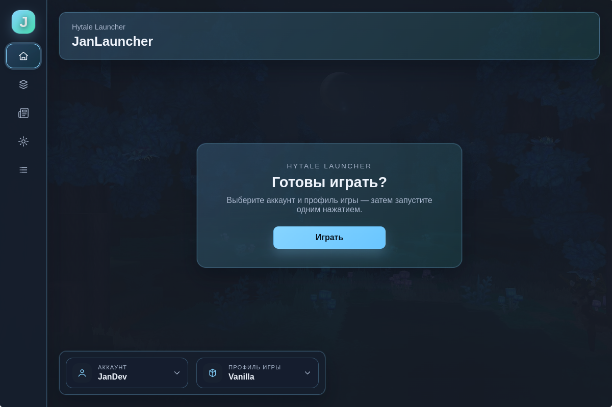
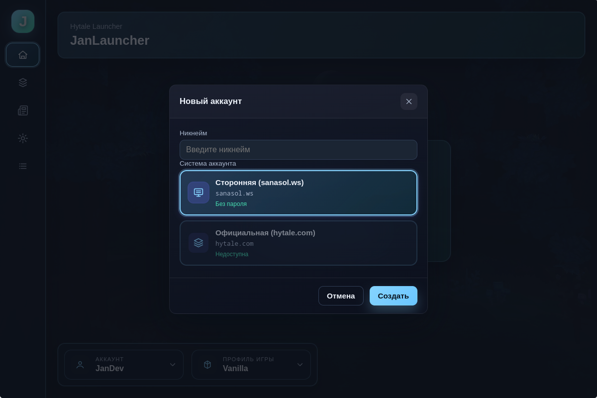
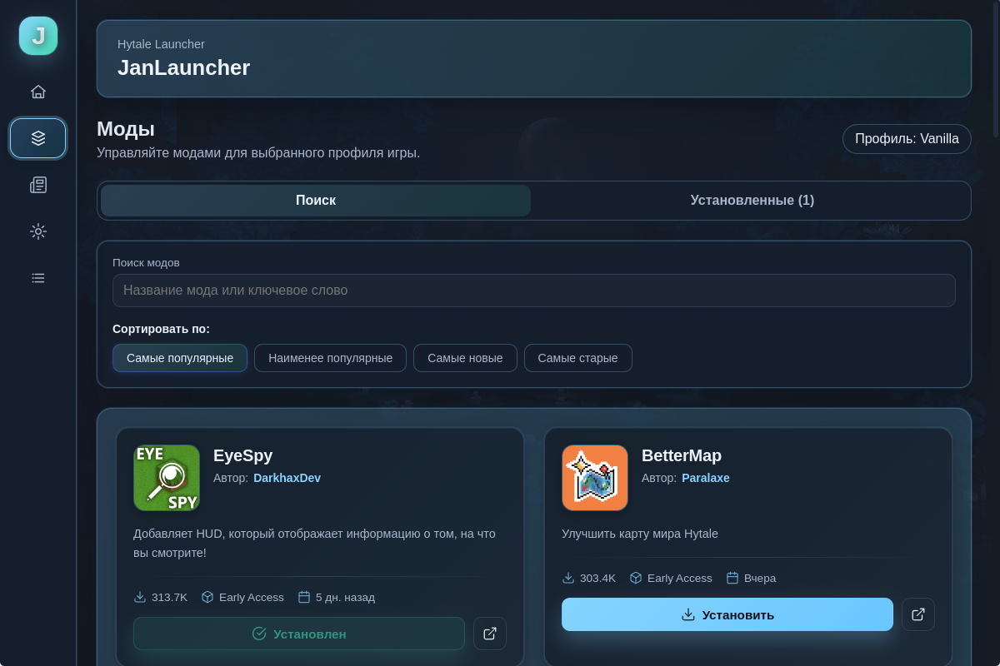
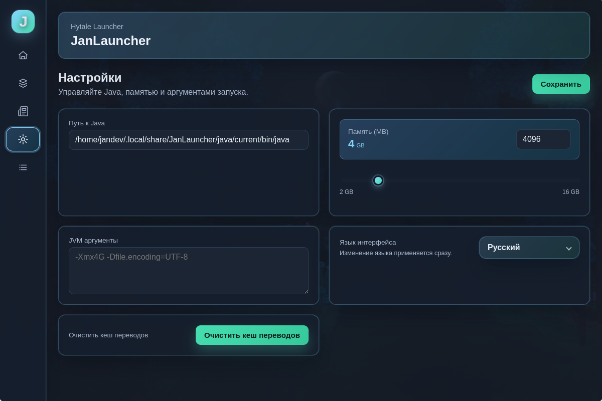
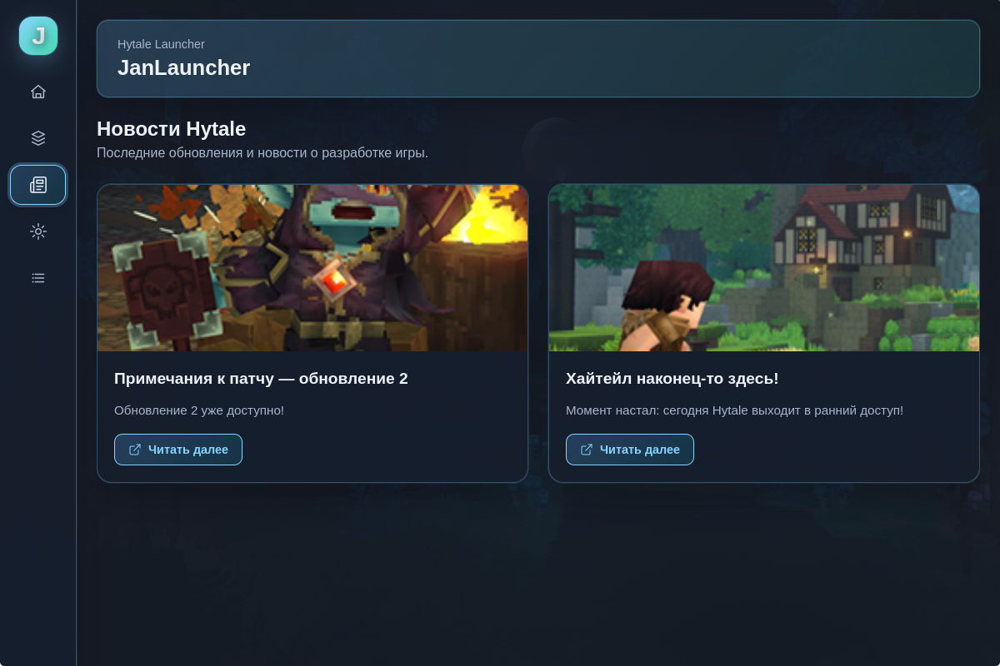

# 🎮 JanLauncher

**Современный и удобный лаунчер для Hytale**

---

---

## 📖 Что такое JanLauncher?

JanLauncher — это современный кроссплатформенный лаунчер, созданный специально для Hytale. Он обеспечивает плавный и интуитивный опыт управления игрой, профилями, модами и многим другим — всё в одном месте.

Независимо от того, являетесь ли вы обычным игроком или любите настраивать свой игровой опыт, JanLauncher упрощает быстрый и эффективный запуск Hytale.

---

## ✨ Возможности

### 🚀 Быстрый запуск
Запускайте Hytale всего несколькими кликами. Никаких сложных настроек — всё работает из коробки.

### 👤 Профили игроков
Создавайте и управляйте несколькими профилями игроков. Легко переключайтесь между разными аккаунтами и держите свой прогресс организованным.

### 🧩 Профили игры и моды
Организуйте настройки игры и моды с помощью пользовательских профилей. Каждый профиль может иметь свою конфигурацию модов, что упрощает переключение между разными игровыми сценариями.

### 📦 Установка и обновления
Автоматическая установка и обновление игры. JanLauncher берёт на себя все технические детали, чтобы вы могли сосредоточиться на игре.

### ☕ Автоматическое управление Java
Не нужно беспокоиться о версиях Java. JanLauncher автоматически определяет, загружает и управляет правильной версией Java для Hytale.

### 🔄 Автоматические обновления
Лаунчер обновляется автоматически, поэтому у вас всегда есть последние функции и улучшения без лишних хлопот.

### 🌍 Новости и переводы
Будьте в курсе последних новостей Hytale прямо в лаунчере. Многоязычная поддержка гарантирует, что вы можете наслаждаться JanLauncher на предпочитаемом языке.

### 🧪 Несколько систем авторизации
Поддержка различных методов аутентификации, дающая вам гибкость в доступе к вашему аккаунту.

---

## 📸 Скриншоты

### Главный экран

*Главный интерфейс лаунчера*

### Профили игроков

*Управление профилями игроков*

### Менеджер модов

*Просмотр и установка модов из CurseForge*

### Настройки

*Настройка вашего опыта использования лаунчера*

### Лента новостей

*Будьте в курсе новостей Hytale*

---

## 📥 Скачивание и установка

### Шаг 1: Скачивание
1. Перейдите на [GitHub Releases](https://github.com/janekdeveloper/JanLauncher/releases)
2. Найдите последнюю версию
3. Скачайте установщик для вашей платформы:
   - **Windows**: `JanLauncher Setup X.X.X.exe`
   - **Linux**: `jan-launcher-X.X.X.AppImage` или пакет `.deb`

### Шаг 2: Установка
- **Windows**: Запустите установщик `.exe` и следуйте инструкциям мастера установки
- **Linux**: 
  - Для AppImage: Сделайте файл исполняемым (`chmod +x jan-launcher-X.X.X.AppImage`) и запустите его
  - Для .deb: Установите с помощью `sudo dpkg -i jan-launcher_X.X.X_amd64.deb`

### Шаг 3: Запуск
Откройте JanLauncher из меню приложений или ярлыка на рабочем столе. Лаунчер проведёт вас через первоначальную настройку.

---

## 🎯 Начало работы

1. **Первый запуск**: При первом открытии JanLauncher поможет вам настроить первый профиль игрока и базовые настройки.

2. **Установка Hytale**: Если вы ещё не установили Hytale, лаунчер предложит автоматически скачать и установить его для вас.

3. **Создание профилей**: Настройте профили игроков и игровые профили для организации вашего игрового опыта.

4. **Установка модов** (опционально): Просмотрите библиотеку модов и установите моды для улучшения вашего опыта в Hytale.

5. **Играйте**: Нажмите кнопку запуска и наслаждайтесь Hytale!

---

## 💬 Сообщество и поддержка

### Discord сервер
Присоединяйтесь к нашему сообществу Discord, чтобы получить помощь, поделиться отзывами и пообщаться с другими игроками:

### Telegram канал
Подписывайтесь на наш Telegram канал для обновлений, новостей и анонсов:

### Проблемы и отзывы
Нашли ошибку или есть предложение? Пожалуйста, создайте issue на GitHub:
[GitHub Issues](https://github.com/janekdeveloper/JanLauncher/issues)

### Вклад в проект
Мы приветствуем вклад! Если вы хотите помочь улучшить JanLauncher, пожалуйста, ознакомьтесь с нашими рекомендациями по участию (скоро).

---

## 📝 Лицензия

Этот проект лицензирован под лицензией MIT — см. файл [LICENSE](LICENSE) для подробностей.

---

## 🙏 Благодарности

- Создано с любовью для сообщества Hytale
- Спасибо всем участникам и тестировщикам
- Особая благодарность всем, кто предоставляет отзывы и предложения

---

**Сделано с ❤️ для сообщества Hytale**

⭐ Если JanLauncher вам полезен, пожалуйста, поставьте звезду! ⭐

