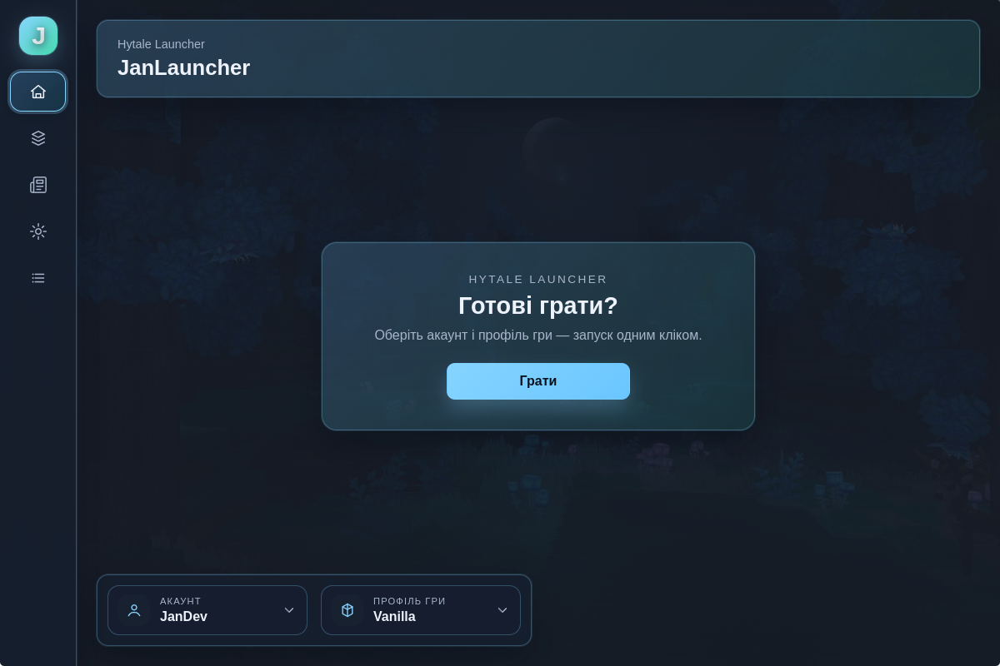
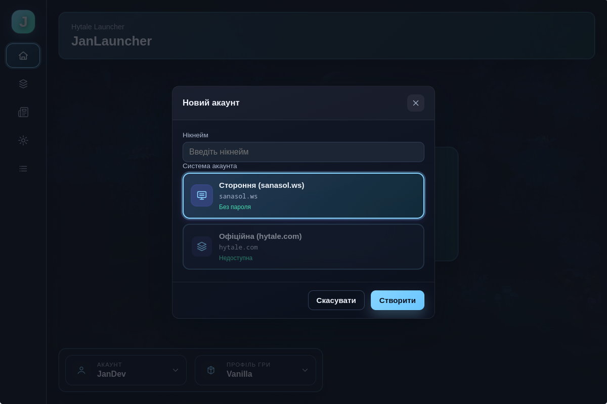
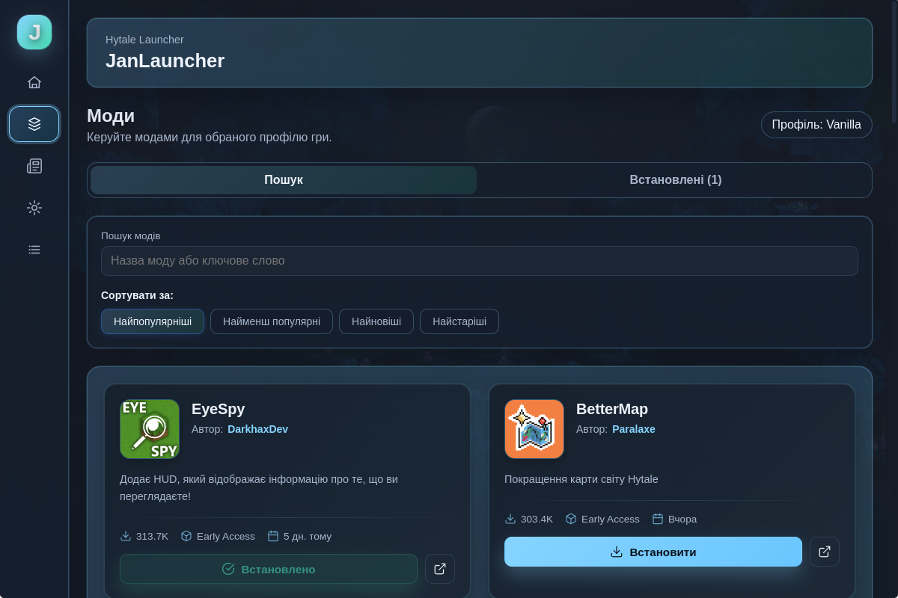
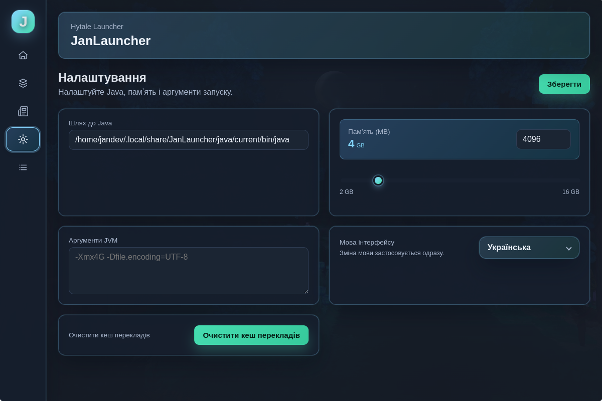
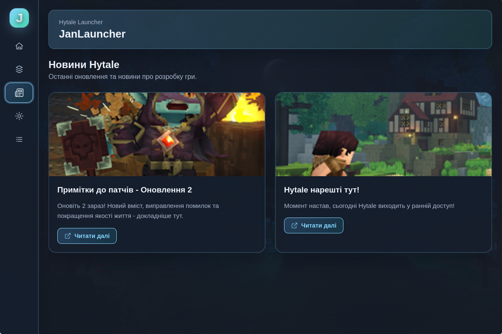

# 🎮 JanLauncher

**Сучасний та зручний лаунчер для Hytale**

---

<!--  -->

---

## 📖 Що таке JanLauncher?

JanLauncher — це сучасний кроссплатформенний лаунчер, створений спеціально для Hytale. Він забезпечує плавний та інтуїтивний досвід управління грою, профілями, модами та багатьма іншими речами — все в одному місці.

Незалежно від того, чи ви звичайний гравець, чи любите налаштовувати свій ігровий досвід, JanLauncher спрощує швидкий та ефективний запуск Hytale.

---

## ✨ Можливості

### 🚀 Швидкий запуск
Запускайте Hytale лише кількома кліками. Жодних складних налаштувань — все працює з коробки.

### 👤 Профілі гравців
Створюйте та керуйте кількома профілями гравців. Легко перемикайтеся між різними акаунтами та тримайте свій прогрес організованим.

### 🧩 Профілі гри та моди
Організуйте налаштування гри та моди за допомогою користувацьких профілів. Кожен профіль може мати свою конфігурацію модів, що спрощує перемикання між різними ігровими сценаріями.

### 📦 Встановлення та оновлення
Автоматичне встановлення та оновлення гри. JanLauncher бере на себе всі технічні деталі, щоб ви могли зосередитися на грі.

### ☕ Автоматичне керування Java
Не потрібно турбуватися про версії Java. JanLauncher автоматично визначає, завантажує та керує правильною версією Java для Hytale.

### 🔄 Автоматичні оновлення
Лаунчер оновлюється автоматично, тому у вас завжди є останні функції та покращення без зайвих клопотів.

### 🌍 Новини та переклади
Будьте в курсі останніх новин Hytale прямо в лаунчері. Багатомовна підтримка гарантує, що ви можете насолоджуватися JanLauncher своєю мовою.

### 🧪 Кілька систем авторизації
Підтримка різних методів аутентифікації, що дає вам гнучкість у доступі до вашого акаунту.

---

## 📸 Скріншоти

### Головний екран

*Головний інтерфейс лаунчера*

### Профілі гравців

*Керування профілями гравців*

### Менеджер модів

*Перегляд та встановлення модів з CurseForge*

### Налаштування

*Налаштування вашого досвіду використання лаунчера*

### Стрічка новин

*Будьте в курсі новин Hytale*

---

## 📥 Завантаження та встановлення

### Крок 1: Завантаження
1. Перейдіть на [GitHub Releases](https://github.com/janekdeveloper/JanLauncher/releases)
2. Знайдіть останню версію
3. Завантажте установщик для вашої платформи:
   - **Windows**: `JanLauncher Setup X.X.X.exe`
   - **Linux**: `jan-launcher-X.X.X.AppImage` або пакет `.deb`

### Крок 2: Встановлення
- **Windows**: Запустіть установщик `.exe` та дотримуйтеся інструкцій майстра встановлення
- **Linux**: 
  - Для AppImage: Зробіть файл виконуваним (`chmod +x jan-launcher-X.X.X.AppImage`) та запустіть його
  - Для .deb: Встановіть за допомогою `sudo dpkg -i jan-launcher_X.X.X_amd64.deb`

### Крок 3: Запуск
Відкрийте JanLauncher з меню програм або ярлика на робочому столі. Лаунчер проведе вас через початкову налаштування.

---

## 🎯 Початок роботи

1. **Перший запуск**: При першому відкритті JanLauncher допоможе вам налаштувати перший профіль гравця та базові налаштування.

2. **Встановлення Hytale**: Якщо ви ще не встановили Hytale, лаунчер запропонує автоматично завантажити та встановити його для вас.

3. **Створення профілів**: Налаштуйте профілі гравців та ігрові профілі для організації вашого ігрового досвіду.

4. **Встановлення модів** (опціонально): Перегляньте бібліотеку модів та встановіть моди для покращення вашого досвіду в Hytale.

5. **Грайте**: Натисніть кнопку запуску та насолоджуйтеся Hytale!

---

## 💬 Спільнота та підтримка

### Discord сервер
Приєднуйтеся до нашої спільноти Discord, щоб отримати допомогу, поділитися відгуками та поспілкуватися з іншими гравцями:

### Telegram канал
Підписуйтеся на наш Telegram канал для оновлень, новин та анонсів:

### Проблеми та відгуки
Знайшли помилку або є пропозиція? Будь ласка, створіть issue на GitHub:
[GitHub Issues](https://github.com/janekdeveloper/JanLauncher/issues)

### Внесок у проект
Ми вітаємо внесок! Якщо ви хочете допомогти покращити JanLauncher, будь ласка, ознайомтеся з нашими рекомендаціями щодо участі (скоро).

---

## 📝 Ліцензія

Цей проект ліцензовано під ліцензією MIT — див. файл [LICENSE](LICENSE) для деталей.

---

## 🙏 Подяки

- Створено з любов'ю для спільноти Hytale
- Дякуємо всім учасникам та тестувальникам
- Особлива подяка всім, хто надає відгуки та пропозиції

---

**Зроблено з ❤️ для спільноти Hytale**

⭐ Якщо JanLauncher вам корисний, будь ласка, поставте зірку! ⭐

